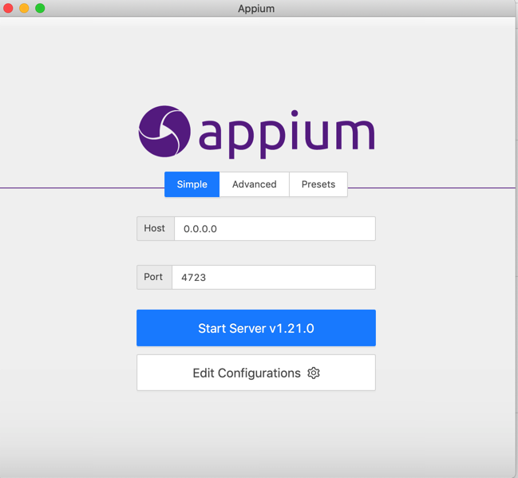
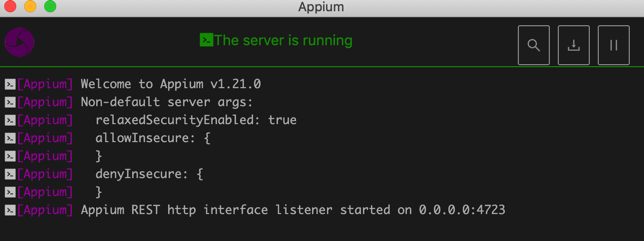
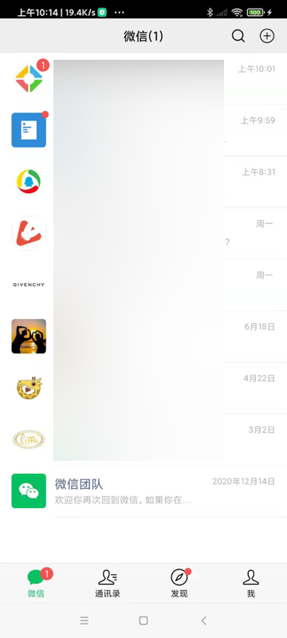
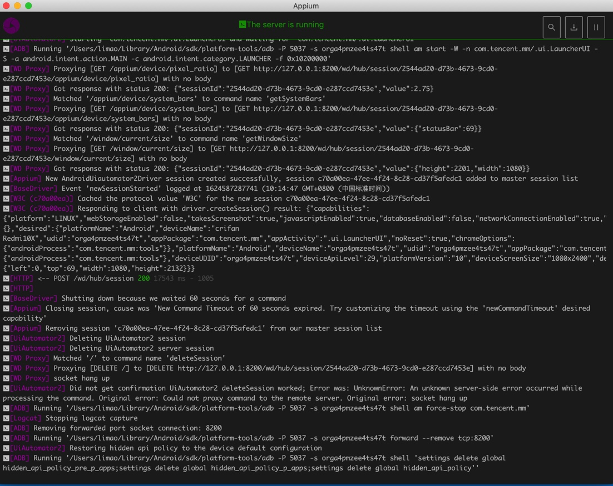
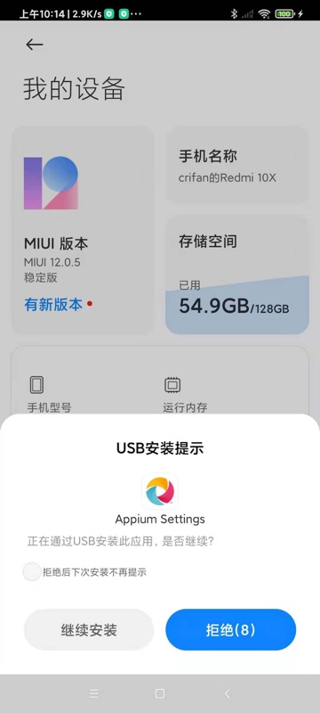
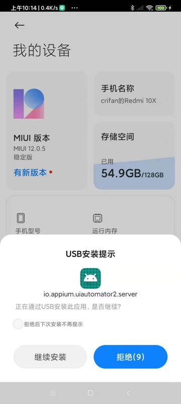

# 搭建环境

## Mac中搭建Appium自动化操作安卓的环境

### Mac中安装Appium Desktop并启动Appium服务

去[Appium的官网](http://appium.io/)，找到的[Github的Release页面](https://github.com/appium/appium-desktop/releases)

下载最新版Appium的Mac客户端。

此处是：`Appium-1.21.0-mac.zip`

下载，解压，得到：`Appium.app`，拖动到`应用程序`，即可安装。

双击`Appium`打开：



* 默认参数
  * `Host`：`0.0.0.0`
  * `Port`：`4723`

点击`Start Server`，以启动Appium的服务（供client端调用接口）

看到log显示：



```bash
Appium REST http interface listener started on 0.0.0.0:4723
```

说明Appium的server端，启动成功

### Mac中安装Appium的Python库

```bash
pip install Appium-Python-Client
```

* 如果用`pipenv`，则是
    ```bash
    pipenv install Appium-Python-Client
    ```

### Mac中：测试代码

```python
from appium import webdriver
server = 'http://localhost:4723/wd/hub’

Android_Redmi10X_DeviceName = "crifan Redmi10X"
Android_Redmi10X_UDID = "orga4pmzee4ts47t"

desired_caps = {
    "platformName": "Android",
    "deviceName": Android_Redmi10X_DeviceName,
    "udid": Android_Redmi10X_UDID,
    "appPackage": "com.tencent.mm",
    "appActivity": ".ui.LauncherUI",
    "noReset": True
}

desired_caps['chromeOptions'] = {'androidProcess': 'com.tencent.mm:tools'}
desired_caps['noReset'] = True

driver = webdriver.Remote(server, desired_caps)
```
* Capability的参数
  * 最核心的三个
    * `platformName`：`Android`
      * 表示安卓平台
    * `udid`：安卓设备的序列号，设备唯一编号
      * 可以通过`adb devices`找到
        * 比如：
            ```bash
            # adb devices
            List of devices attached
            orga4pmzee4ts47t    device
            ```
        * 中的`orga4pmzee4ts47t`
    * `deviceName`：随便填个值（当然最好是见名知意用户看得懂的值）
      * 比如
        * `"deviceName": "crifan Redmi10X",`
  * 详见
      * [Desired Capabilities - Appium](https://appium.io/docs/en/writing-running-appium/caps/)

效果：

* 正常打开了微信app
  * 
* Appium Desktop客户端中输出对应的log
  * 图
    * 
  * （拷贝出的）文字
    ```bash
    [debug] [35m[WD Proxy][39m Proxying [POST /session] to [POST http://127.0.0.1:8200/wd/hub/session] with body: {"capabilities":{"firstMatch":[{"platform":"LINUX","webStorageEnabled":false,"takesScreenshot":true,"javascriptEnabled":true,"databaseEnabled":false,"networkConnectionEnabled":true,"locationContextEnabled":false,"warnings":{},"desired":{"platformName":"Android","deviceName":"crifan Redmi10X","udid":"orga4pmzee4ts47t","appPackage":"com.tencent.mm","appActivity":".ui.LauncherUI","noReset":true,"chromeOptions":{"androidProcess":"com.tencent.mm:tools"}},"platformName":"Android","deviceName":"orga4pmzee4ts47t","udid":"orga4pmzee4ts47t","appPackage":"com.tencent.mm","appActivity":".ui.LauncherUI","noReset":true,"chromeOptions":{"androidProcess":"com.tencent.mm:tools"},"deviceUDID":"orga4pmzee4ts47t"}],"alwaysMatch":{}}}
    [debug] [35m[WD Proxy][39m Got response with status 200: {"sessionId":"2544ad20-d73b-4673-9cd0-e287ccd7453e","value":{"capabilities":{"firstMatch":[{"platform":"LINUX","webStorageEnabled":false,"takesScreenshot":true,"javascriptEnabled":true,"databaseEnabled":false,"networkConnectionEnabled":true,"locationContextEnabled":false,"warnings":{},"desired":{"platformName":"Android","deviceName":"crifan Redmi10X","udid":"orga4pmzee4ts47t","appPackage":"com.tencent.mm","appActivity":".ui.LauncherUI","noReset":true,"chromeOptions":{"androidProcess":"com.tencent.mm:tools"}},"platformName":"Android","deviceName":"orga4pmzee4ts47t","udid":"orga4pmzee4ts47t","appPackage":"com.tencent.mm","appActivity":".ui.LauncherUI","noReset":true,"chromeOptions":{"androidProcess":"com.tencent.mm:tools"},"deviceUDID":"orga4pmzee4ts47t"}],"alwaysMatch":{}},"sessionId":"2544ad20-d73b-4673-9cd0-e287ccd7453e"}}
    [info] [35m[WD Proxy][39m Determined the downstream protocol as 'W3C'
    [debug] [35m[WD Proxy][39m Proxying [GET /appium/device/info] to [GET http://127.0.0.1:8200/wd/hub/session/2544ad20-d73b-4673-9cd0-e287ccd7453e/appium/device/info] with no body
    [debug] [35m[WD Proxy][39m Got response with status 200: {"sessionId":"2544ad20-d73b-4673-9cd0-e287ccd7453e","value":{"androidId":"edca4ce87a26685a","apiVersion":"29","bluetooth":{"state":"ON"},"brand":"Redmi","carrierName":"","displayDensity":440,"locale":"zh_CN","manufacturer":"Xiaomi","model":"M2004J7AC","networks":[{"capabilities":{"SSID":null,"linkDownBandwidthKbps":1048576,"linkUpstreamBandwidthKbps":1048576,"networkCapabilities":"NET_CAPABILITY_NOT_METERED,NET_CAPABILITY_INTERNET,NET_CAPABILITY_NOT_RESTRICTED,NET_CAPABILITY_TRUSTED,NET_CAPABILITY_NOT_VPN,NET_CAPABILITY_VALIDATED,NET_CAPABILITY_NOT_ROAMING,NET_CAPABILITY_FOREGROUND,NET_CAPABILITY_NOT_CONGESTED,NET_CAPABILITY_NOT_SUSPENDED","signalStrength":-19,"transportTypes":"TRANSPORT_WIFI"},"detailedState":"CONNECTED","extraInfo":null,"isAvailable":true,"isConnected":true,"isFailover":false,"isRoaming":false,"state":"CONNECTED","subtype":0,"subtypeName":"","type":1,"typeName":"WIFI"}],"platformVersion":"10","realDisplaySize":"1080x2400","timeZone":"Asia/Shanghai"}}
    [debug] [35m[ADB][39m Running '/Users/limao/Library/Android/sdk/platform-tools/adb -P 5037 -s orga4pmzee4ts47t shell dumpsys window'
    [info] [35m[AndroidDriver][39m Screen already unlocked, doing nothing
    [info] [35m[UiAutomator2][39m Starting 'com.tencent.mm/.ui.LauncherUI and waiting for 'com.tencent.mm/.ui.LauncherUI'
    [debug] [35m[ADB][39m Running '/Users/limao/Library/Android/sdk/platform-tools/adb -P 5037 -s orga4pmzee4ts47t shell am start -W -n com.tencent.mm/.ui.LauncherUI -S -a android.intent.action.MAIN -c android.intent.category.LAUNCHER -f 0x10200000'[debug] [35m[WD Proxy][39m Proxying [GET /appium/device/pixel_ratio] to [GET http://127.0.0.1:8200/wd/hub/session/2544ad20-d73b-4673-9cd0-e287ccd7453e/appium/device/pixel_ratio] with no body
    [debug] [35m[WD Proxy][39m Got response with status 200: {"sessionId":"2544ad20-d73b-4673-9cd0-e287ccd7453e","value":2.75}
    [debug] [35m[WD Proxy][39m Matched '/appium/device/system_bars' to command name 'getSystemBars'
    [debug] [35m[WD Proxy][39m Proxying [GET /appium/device/system_bars] to [GET http://127.0.0.1:8200/wd/hub/session/2544ad20-d73b-4673-9cd0-e287ccd7453e/appium/device/system_bars] with no body
    [debug] [35m[WD Proxy][39m Got response with status 200: {"sessionId":"2544ad20-d73b-4673-9cd0-e287ccd7453e","value":{"statusBar":69}}
    [debug] [35m[WD Proxy][39m Matched '/window/current/size' to command name 'getWindowSize'
    [debug] [35m[WD Proxy][39m Proxying [GET /window/current/size] to [GET http://127.0.0.1:8200/wd/hub/session/2544ad20-d73b-4673-9cd0-e287ccd7453e/window/current/size] with no body
    [debug] [35m[WD Proxy][39m Got response with status 200: {"sessionId":"2544ad20-d73b-4673-9cd0-e287ccd7453e","value":{"height":2201,"width":1080}}
    [info] [35m[Appium][39m New AndroidUiautomator2Driver session created successfully, session c70a00ea-47ee-4f24-8c28-cd37f5afedc1 added to master session list
    [debug] [35m[BaseDriver][39m Event 'newSessionStarted' logged at 1624587287741 (10:14:47 GMT+0800 (中国标准时间))
    [debug] [35m[W3C (c70a00ea)][39m Cached the protocol value 'W3C' for the new session c70a00ea-47ee-4f24-8c28-cd37f5afedc1
    [debug] [35m[W3C (c70a00ea)][39m Responding to client with driver.createSession() result: {"capabilities":{"platform":"LINUX","webStorageEnabled":false,"takesScreenshot":true,"javascriptEnabled":true,"databaseEnabled":false,"networkConnectionEnabled":true,"locationContextEnabled":false,"warnings":{},"desired":{"platformName":"Android","deviceName":"crifan Redmi10X","udid":"orga4pmzee4ts47t","appPackage":"com.tencent.mm","appActivity":".ui.LauncherUI","noReset":true,"chromeOptions":{"androidProcess":"com.tencent.mm:tools"}},"platformName":"Android","deviceName":"orga4pmzee4ts47t","udid":"orga4pmzee4ts47t","appPackage":"com.tencent.mm","appActivity":".ui.LauncherUI","noReset":true,"chromeOptions":{"androidProcess":"com.tencent.mm:tools"},"deviceUDID":"orga4pmzee4ts47t","deviceApiLevel":29,"platformVersion":"10","deviceScreenSize":"1080x2400","deviceScreenDensity":440,"deviceModel":"M2004J7AC","deviceManufacturer":"Xiaomi","pixelRatio":2.75,"statBarHeight":69,"viewportRect":{"left":0,"top":69,"width":1080,"height":2132}}}
    [info] [35m[HTTP][39m [37m<-- POST /wd/hub/session [39m[32m200[39m [90m17543 ms - 1005[39m
    [info] [35m[HTTP][39m [90m[39m[warn] [35m[BaseDriver][39m Shutting down because we waited 60 seconds for a command
    [warn] [35m[Appium][39m Closing session, cause was 'New Command Timeout of 60 seconds expired. Try customizing the timeout using the 'newCommandTimeout' desired capability'
    [info] [35m[Appium][39m Removing session 'c70a00ea-47ee-4f24-8c28-cd37f5afedc1' from our master session list
    [debug] [35m[UiAutomator2][39m Deleting UiAutomator2 session
    [debug] [35m[UiAutomator2][39m Deleting UiAutomator2 server session
    [debug] [35m[WD Proxy][39m Matched '/' to command name 'deleteSession'
    [debug] [35m[WD Proxy][39m Proxying [DELETE /] to [DELETE http://127.0.0.1:8200/wd/hub/session/2544ad20-d73b-4673-9cd0-e287ccd7453e] with no body
    [info] [35m[WD Proxy][39m socket hang up
    [warn] [35m[UiAutomator2][39m Did not get confirmation UiAutomator2 deleteSession worked; Error was: UnknownError: An unknown server-side error occurred while processing the command. Original error: Could not proxy command to the remote server. Original error: socket hang up
    [debug] [35m[ADB][39m Running '/Users/limao/Library/Android/sdk/platform-tools/adb -P 5037 -s orga4pmzee4ts47t shell am force-stop com.tencent.mm'
    [debug] [35m[Logcat][39m Stopping logcat capture
    [debug] [35m[ADB][39m Removing forwarded port socket connection: 8200
    [debug] [35m[ADB][39m Running '/Users/limao/Library/Android/sdk/platform-tools/adb -P 5037 -s orga4pmzee4ts47t forward --remove tcp:8200'
    [info] [35m[UiAutomator2][39m Restoring hidden api policy to the device default configuration
    [debug] [35m[ADB][39m Running '/Users/limao/Library/Android/sdk/platform-tools/adb -P 5037 -s orga4pmzee4ts47t shell 'settings delete global hidden_api_policy_pre_p_apps;settings delete global hidden_api_policy_p_apps;settings delete global hidden_api_policy''
    ```

### 安卓手机：点击允许安装app

第一次运行Appium的代码，会触发Appium去给安卓手机安装必要的app：

* `Appium Settings`
  * 
* `ios.appium.uiautomator2.server`
  * 
* `io.appium.uiautomator2.server.test`
  * 

注意：及时点击`继续安装`，允许安装。
