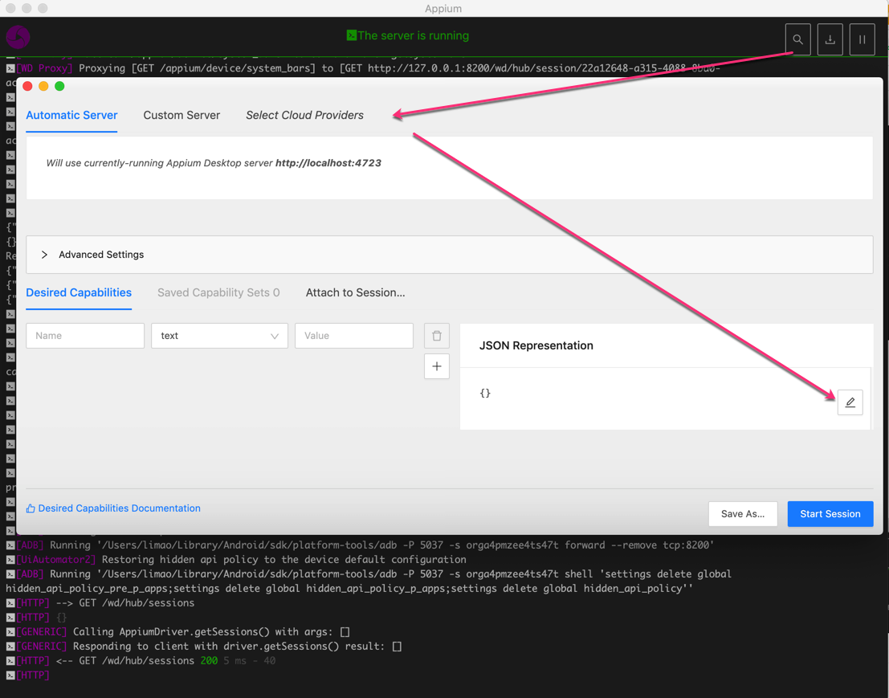
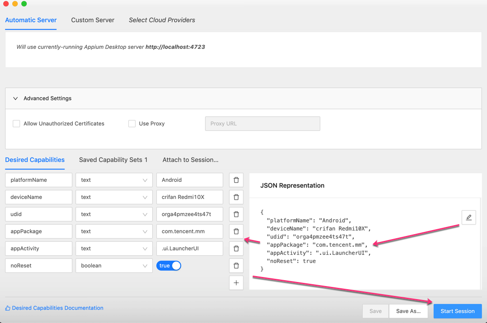
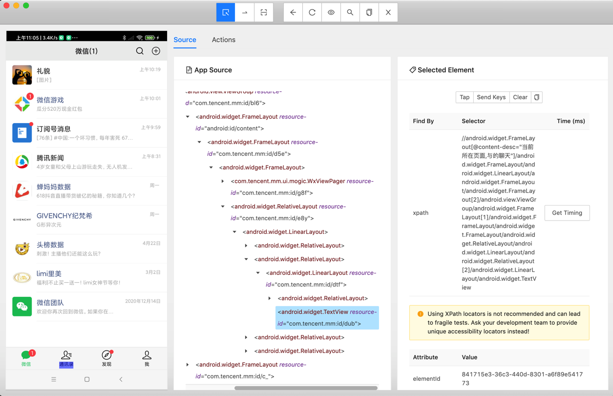
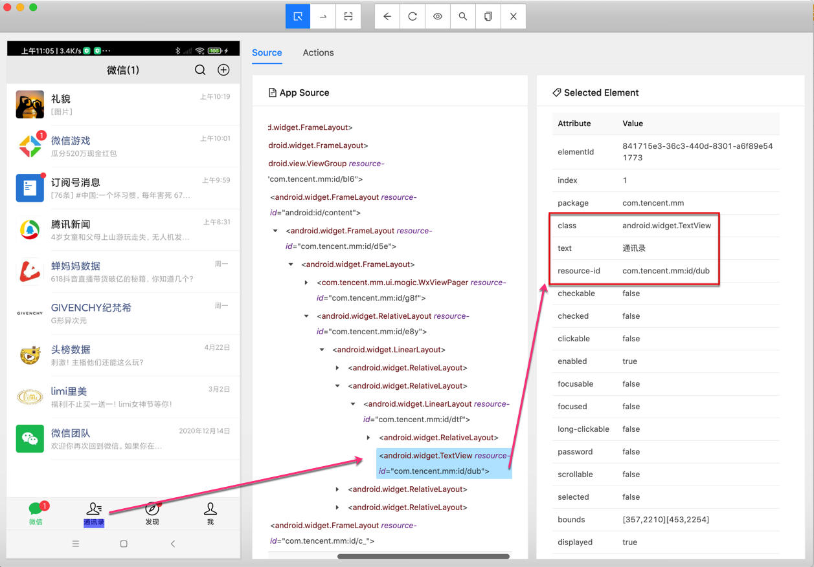
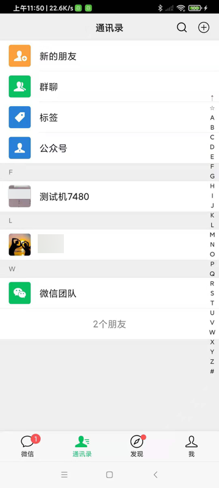

# 调试界面

## 调试安卓界面

### Mac中用Appium的界面调试工具去调试安卓手机端的界面

在Appium的桌面客户端中，点击 放大镜🔍，启动参数配置界面：



点击`JSON Representation`的编辑按钮，输入`Capability`的`json`配置

比如此处是：

```json
{
    "platformName": "Android",
    "deviceName": "crifan Redmi10X",
    "udid": "orga4pmzee4ts47t",
    "appPackage": "com.tencent.mm",
    "appActivity": ".ui.LauncherUI",
    "noReset": true
}
```

点击Save，自动保存和解析出相关参数：



点击`Start Session`，（稍等片刻）即可启动调试界面

然后点击手机页面中的元素，右边即可看到属性：





也可以拷贝出属性值：

```bash
Attribute    Value
elementId 841715e3-36c3-440d-8301-a6f89e541773
index 1
package com.tencent.mm
class android.widget.TextView
text 通讯录
resource-id com.tencent.mm:id/dub
checkable false
checked false
clickable false
enabled true
focusable false
focused false
long-clickable false
password false
scrollable false
selected false
bounds [357,2210][453,2254]
displayed true
```

其中，可以用于定位的，一般是用：

* `class`：`android.widget.TextView`
* `text`：`通讯录`
* `resource-id`：`com.tencent.mm:id/dub`

写成代码，可以是：

```python
driver.find_element_by_xpath("//android.widget.TextView[@resource-id='com.tencent.mm:id/dub']")
```

也可以是：

```python
driver.find_element_by_xpath("//android.widget.TextView[@text='通讯录']")
```

即可用上述定位元素的代码，去调试你的业务逻辑了。

比如此处可以接着点击`通讯录`：

```python
contactElement = driver.find_element_by_xpath("//android.widget.TextView[@text='通讯录']")
contactElement.click()
```

进入通讯录的tab页面了：



心得：

* appium 和 Appium的GUI界面调试工具：没有uiautomator2的weditor好用
  * appium（不论是Python的代码，还是 界面调试工具）连接了安卓手机后（比如打开了微信app)，会导致用户无法正常手动操作(微信)
    * 而weditor，就不会影响用户手动操作

结论：

* appium不好用。不建议继续用appium
    * 建议换用：uiautomator2 + weditor
