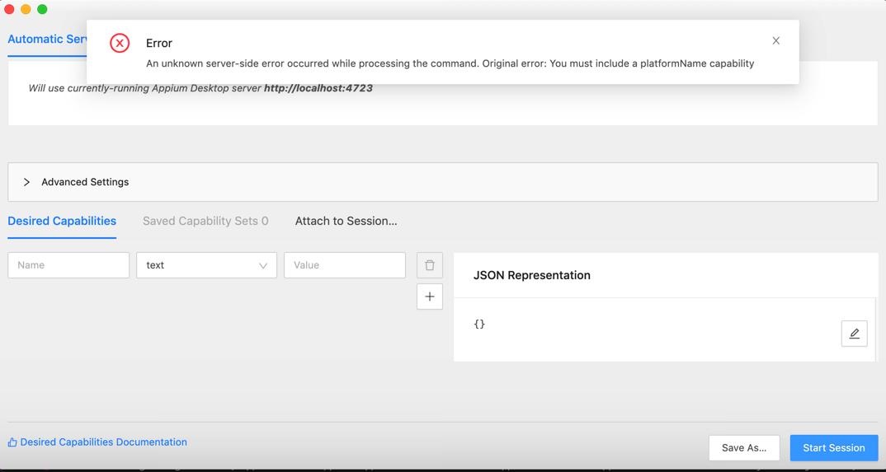
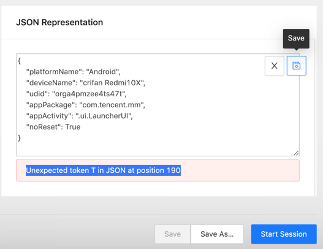
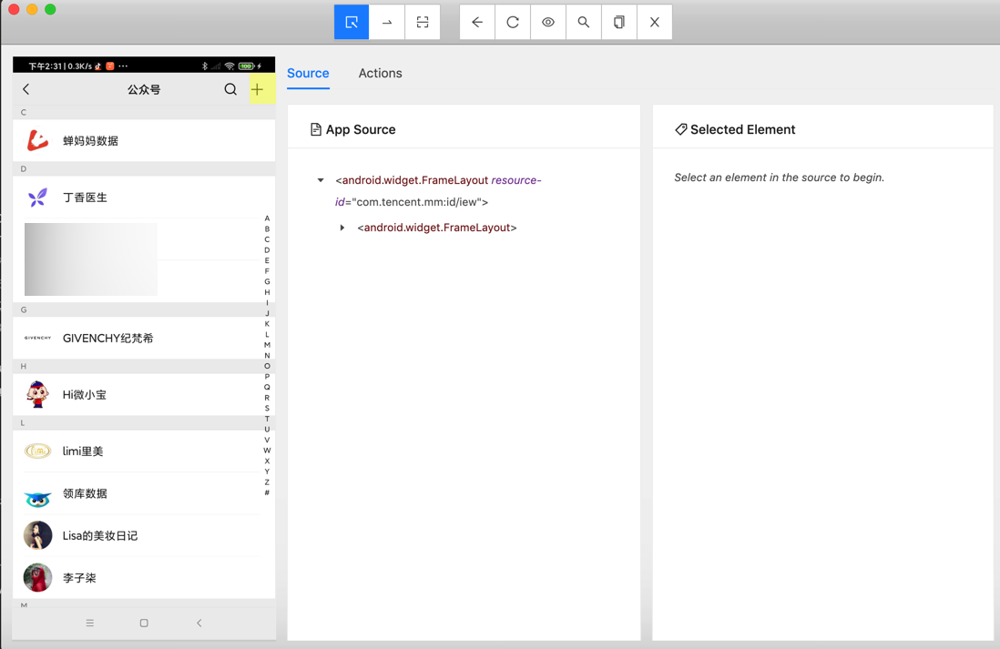
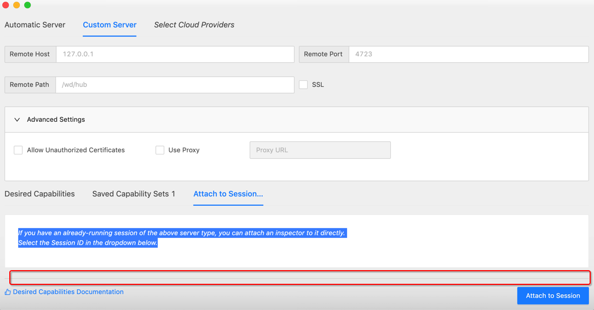
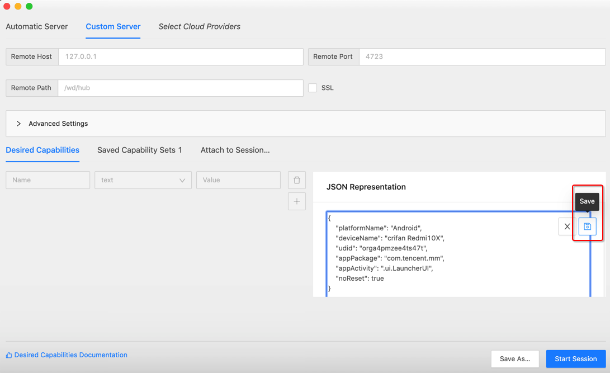

# 常见问题和心得

此处总结Appium开发期间常遇到的一些问题和一些使用方面的心得和经验：

## Original error: Could not find a connected Android device

此处appium启动报错

```bash
Original error: Could not find a connected Android device
```

意思是，连不上，找不到设备。

解决办法：

* 硬件上
  * 确保安卓设备正常通过USB数据线连接到了Mac中
    * `adb devices`
      * 可以查看到设备（的udid值）
* 软件上
  * 参数配置，最核心的是三个
    * `platformName`：Android
      * 安卓平台
    * `udid`：安卓设备的序列号，设备唯一编号
      * 可以通过 `adb devices`找到
    * deviceName：随便填个值（当然最好是见名知意用户看得懂的值）
      * 比如
        * `"deviceName": "crifan Redmi10X"`

具体参数解释，详见官网

[Desired Capabilities - Appium](https://appium.io/docs/en/writing-running-appium/caps/)

或：

[appium/caps.md at master · appium/appium (github.com)](https://github.com/appium/appium/blob/master/docs/en/writing-running-appium/caps.md)

## Original error You must include a platformName capability

背景：已启动了appium的server端.

已用Python代码，加上Capability参数，启动了client端，且成功打开了当前的app：微信

然后希望用appium的GUI图形界面`Appium Desktop`中点击`放大镜🔎` 后，出现的调试界面，其中点击`Start Session`，但是报错：

```bash
An unknown server-side error occurred while processing the command.
Original error: You must include a platformName capability
```



原因：没有填入`platformName`参数

解决办法：填入参数即可

但要额外说明的是：

* 此处appium的GUI调试界面，要填写的Capability参数，和Python代码中Capability参数，没关系
  * 就不会，像我本以为的，appium的server内部，自动填入python代码传递的参数了
* GUI中填写Capability参数时，可以直接一次性写好JSON字符串，放到 JSON Representation中，点击Save，即可自动解析到左边参数列表中
  * 注意
    * 如果填写的json有错误，会有错误提示的
      * 注：GUI窗口要足够大，确保能看到JSON Representation底部的JSON错误提示
          * 
        * 我开始就是，窗口太小，没看到底部错误提示，而搞不清为何还是报错
  * 说明
    * `Save`后，记得`Save as`一下，可以直接加载，避免每次充分输入参数。
      * 正常`Save`后，第二个Tab：`Saved Capability Set` 后面会有个数提示，比如`1`，`2`。点击`Saved Capability Set`，可以看到参数详情。

附上，此处的参数：

```json
{
    "platformName": "Android",
    "deviceName": "crifan Redmi10X",
    "udid": "orga4pmzee4ts47t",
    "appPackage": "com.tencent.mm",
    "appActivity": ".ui.LauncherUI",
    "noReset": true
}
```

其中：

* json中，不支持Python中的**True**，要写成小写的**true**

## Appium Inspector调试连接已存在的session会话

经过后续确认，Appium也是支持调试连接已有session的。

背景是：此处已用Python连接了Appium的Server，已经正在操控安卓手机了，比如点击进去了新的页面。

此时，希望搞清楚新页面中元素细节，以便于写代码定位元素，实现点击元素等后续操作。

希望此处可以用Appium去连接和调试，且同时不要冲突了当前的Python连接。

后续得知，此种需求就叫做：Appium的调试工具Appium Inspector，连接已存在的会话

操作方法：切换到`Attach to Sesssion`

![appium_inspector_attach_session]

```bash
If you have an already-running session of the above server type, you can attach an inspector to it directly.
Select the Session ID in the dropdown below.
```

然后Appium Inspector会自动检测出当前已有的session，点击切换到你要连接的session，再点击`Attach to Sesssion`

即可，不影响现有手机中的画面，可以开始调试找元素属性了：



注意：

确保当前Inspector的窗口高度足够高，不要出现我之前遇到的：

Inspector窗口高度太低，比如：



就会导致，上面的 已检测出的session的列表，看不到了。

从而误以为，Appium Inspector不支持连接已有session的功能呢。

## Appium保存参数配置

Appium Inspector支持，保存参数，避免每次都要很麻烦的输入参数才能连接设备。

步骤是：

Appium Inspector，在输入和Save了Capability的参数后，点击`Save`：



后，再切换到`Saved Capability Set`，且有个后缀数字，此处是`1`，表示已保存了1个配置：


如此，即可保存配置，以后每次无需再次输入参数，即可，点击选中当前要用的配置，再点击`Start Session`即可连接设备。
